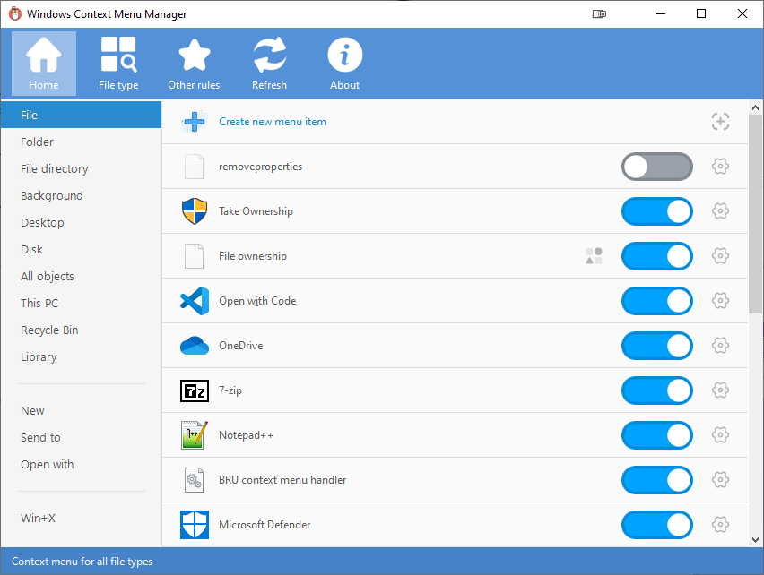

**[简体中文](README.md)** | **English**
# ContextMenuManager

------
> 🖱️ A program to manage the Windows right-click context menu.

## Download the binary
* [Github Releases][GitHub Releases] or [Gitee Releases][Gitee Releases]
* Download the zip file (recommended) or the exe file in the Assets list
* About .NET versions: the .NET 3.5 and .NET 4.0 both are compatible with Windows Vista, 7, 8, 8.1, 10
 Win7 comes with .NET 3.5, Win8, 8.1, 10 come with .NET 4.0 and up. Vista does not come with .NET 3.5 or 4.0.   You may need to install the appropriate [.NET Framework Runtime Library][.NET Framework Runtime Library].

## Key features
* Enable and disable context menu options for files, folders, submenus (e.g. open, send to), Internet Explorer, and Win+X
* Modify menu names and icons
* Delete context menu entries
* Navigate menus in the registry or File Explorer
* Add custom menu items and commands

## Supported systems and features
* Windows Vista, 7, 8, 8.1, 10
* 32 and 64 bit operating systems
* Support for display scaling, optimal at 150% DPI
* localization support: contributions are welcome

## Screenshots

## Third-party resources
* Main program icon from [EasyIcon][EasyIcon] ![][AppIcon]
* [Button icons][AppImage] from [Alibaba Iconfont][IconFont]

## Updates
* Program and dictionary updates can be installed within the program, overwritting the original files.
* Due to limitations with Github and Gitee Raw, the program can only check for updates once a month.   The latest updates can always be found on [Github Releases][GitHub Releases] or [Gitee Releases][Gitee Releases].

## Notices
* Some special menu items (Shell extensions, file encryption(&Y)) may not be displayed in the context menu, but will still show as enabled within the program; this is normal.
* Different context menu manager programs may use different methods for disabling menu options. Using multiple managers at the same time is not recommended. While other programs may use destructive methods, this program utilizes the registry keys provided by the system to hide menu items when possible.
 If you have used other context menu managers in the past, use that program to restore the menu items before using this one in order to avoid any potential issues.
* This program is not designed to perform clean uninstalls; however, it can help you find the registry and file locations of menu items so that they can be modified. If you are not familar with such operations, it is recommended you use the enable/disable functions only.

## Contact author
* This program was developed independently by me (BluePointLilac), though I would like to thank [PcMoe][PcMoe] admin @坑晨 for answering my questions. There will inevitably be bugs, so any reports and suggestions are welcome.
* My Bilibili page: [蓝点lilac][Bilibili]（Follow me!）
* My e-mail: 1617859183@qq.com

## Donations
This program is completely free of charge; if you find this program useful, you can donate in yuan by scanning the QR codes below（WeChat, Alipay, QQ) 
 Any amount is welcome，thank you for your understanding and support! Please also don't forget to star this repo (It means a lot to me!） [Donate List](Donate.md) ![][Donate]

  [EasyIcon]: https://www.easyicon.net/1208132-mouse_icon.html
  [AppIcon]: ContextMenuManager/Properties/AppIcon.ico
  [AppImage]: ContextMenuManager/Properties/Resources/Images
  [IconFont]: https://www.iconfont.cn
  [HashLnk]: https://github.com/riverar/hashlnk
  [GitHub Releases]: https://github.com/BluePointLilac/ContextMenuManager/releases
  [Gitee Releases]: https://gitee.com/BluePointLilac/ContextMenuManager/releases
  [PcMoe]: http://www.pcmoe.net
  [Bilibili]: https://space.bilibili.com/34492771
  [Donate]: ContextMenuManager/Properties/Resources/Images/Donate.png
  [.NET Framework Runtime Library]: https://dotnet.microsoft.com/download/dotnet-framework