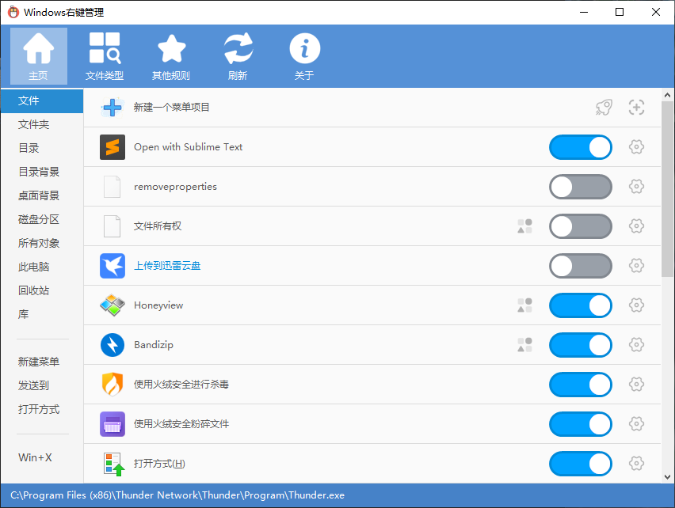
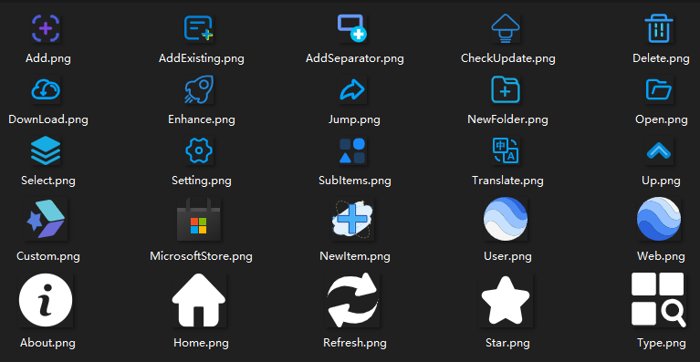

**简体中文** | **[English](README-en.md)**
# ContextMenuManager

------
> 🖱️ 一个纯粹的Windows右键菜单管理程序

## 程序下载
* [最新版本][Latest] 
  [GitHub Releases][GitHub Releases] 
  [Gitee Releases][Gitee Releases] 
* 下载说明：在Assets文件列表里面下载zip（建议）或者直接下载exe
* .NET版本说明：程序分为.NET3.5版和.NET4.0版，均适用于Win10、8.1、8、7、Vista系统 
  win7自带.NET3.5，win8、win8.1、win10自带.NET4.0以上版本，Vista系统既不自带.NET3.5也不自带4.0以上版本 
  自带.NET可直接运行程序，不自带则需要安装对应版本的[.NET Framework运行库][.NET Framework]

## 主要功能
* 启用或禁用文件、文件夹、新建、发送到、打开方式、自定义文件格式、IE浏览器、WinX等右键菜单项目
* 对上述场景右键菜单项目进行修改名称、修改图标、导航注册表位置、导航文件位置、永久删除等操作
* 对上述场景右键菜单自定义添加项目，自定义菜单命令

## 兼容性能
* 适用于Win10、8.1、8、7、Vista
* 适用于 64bit、32bit CPU 操作系统
* 适用于高分屏，最佳显示缩放比为150%
* 程序支持国际化多语言显示，欢迎为此程序制作语言字典

## 运行截图

## 资源引用
* 程序主图标来自 [EasyIcon][EasyIcon] 
![][AppIcon]
* [程序按钮图标][AppImage] 主要来自于 [阿里巴巴矢量图标资源库][IconFont] 

## 温馨提示
* 程序需要对大量的注册表项和文件进行读写删改操作，这些行为比较敏感， 
可能会被 Windows Defender 等误报为病毒，如发生此情况请自行添加进白名单。

* 一些特殊菜单项可能会受到其他因素影响导致不会直接显示在右键菜单中， 但是按照程序使用的通用规则在此程序中仍会显示为启用，这是正常的现象。

* 每个右键管理程序禁用菜单方法可能不同，建议不要同时使用多个右键菜单管理程序， 
大部分程序使用简单暴力的备份删除法，此程序尽可能使用了系统提供的键值进行隐藏， 
通过其他程序禁用的菜单项目。请先使用对应程序还原，不然可能无法在此程序中看到它。

* 此程序不用于清理未卸载干净的程序，但是可以帮助你快速定位菜单项相关注册表位置和文件位置， 你可以根据相关内容进行你的操作。如果你是一个电脑小白，建议只使用启用\禁用功能。

## 联系作者
* 程序由我个人独立开发，当然也要感谢 [萌研社][PcMoe] 站长 @坑晨 平时的答疑解惑。 
能力有限，难免出现一些Bug，欢迎大家积极反馈Bug和提出优化建议。
* 个人B站：[蓝点lilac][Bilibili]（欢迎大家关注我！）
* 个人邮箱：1617859183@qq.com

## 捐赠作者
此程序完全免费，如果你觉得这个程序对你有所帮助，可以通过扫面下方二维码（微信、支付宝、QQ） 
进行捐赠，金额请随意，谢谢你的理解和支持！更加期待你为此项目点亮Star（这对我很重要！） 
[捐赠名单](Donate.md) ![][Donate]

## 项目收藏

  [Latest]: https://github.com/BluePointLilac/ContextMenuManager/releases/latest
  [GitHub Releases]: https://github.com/BluePointLilac/ContextMenuManager/releases
  [Gitee Releases]: https://gitee.com/BluePointLilac/ContextMenuManager/releases
  [.NET Framework]:https://dotnet.microsoft.com/download/dotnet-framework
  [EasyIcon]: https://www.easyicon.net/1208132-mouse_icon.html
  [AppIcon]: ContextMenuManager/Properties/AppIcon.ico
  [AppImage]: ContextMenuManager/Properties/Resources/Images
  [IconFont]: https://www.iconfont.cn
  [PcMoe]: http://www.pcmoe.net
  [Bilibili]: https://space.bilibili.com/34492771
  [Donate]: ContextMenuManager/Properties/Resources/Images/Donate.png
